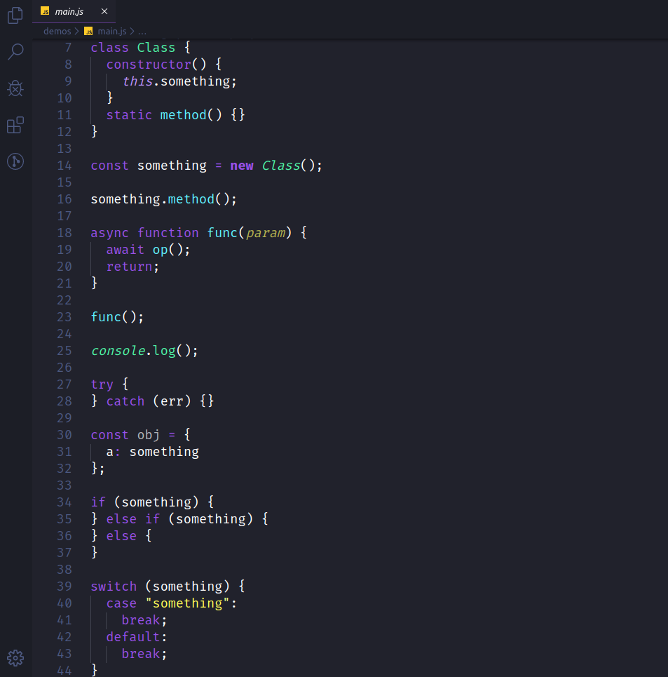
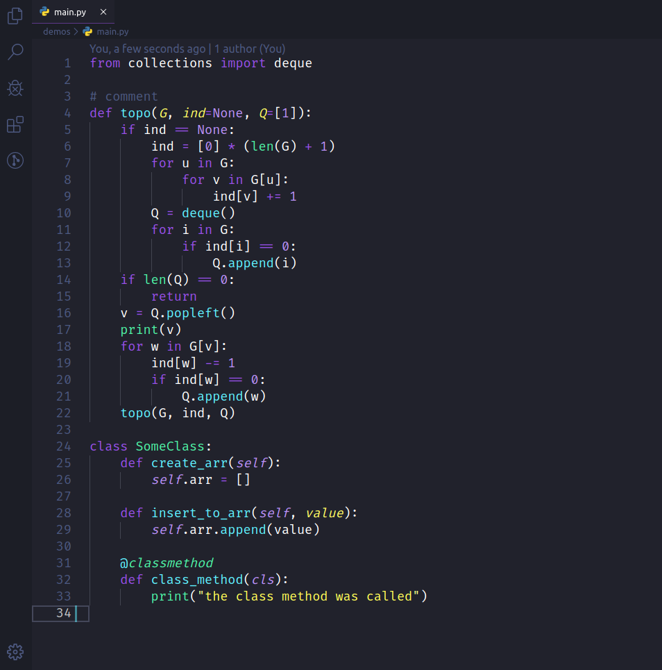
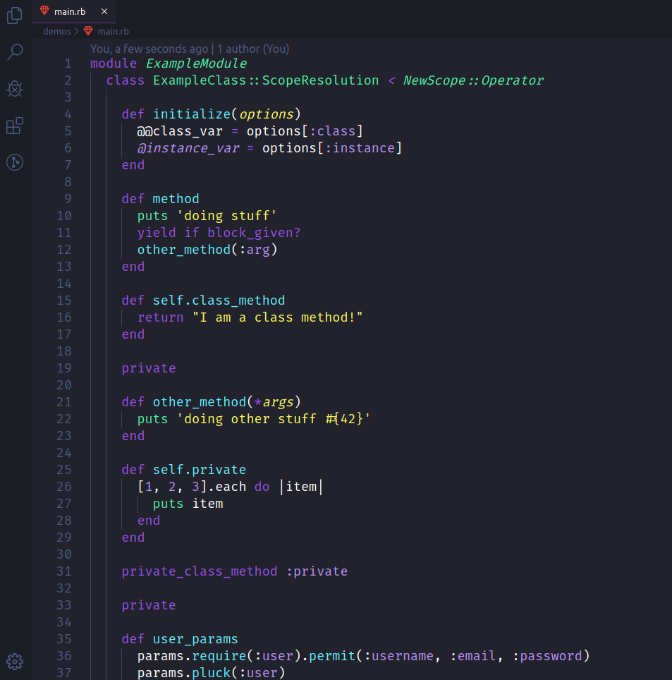

  

<h1 align="center">
  Azeny for Visual Studio Code
</h1>

 A Night Theme for Night Programmers.

   
  

  

  

<h2 align="center">Java Scripy</h2>

  

<h2 align="center">Python</h2>

  

<h2 align="center">Ruby</h2>

  

---

