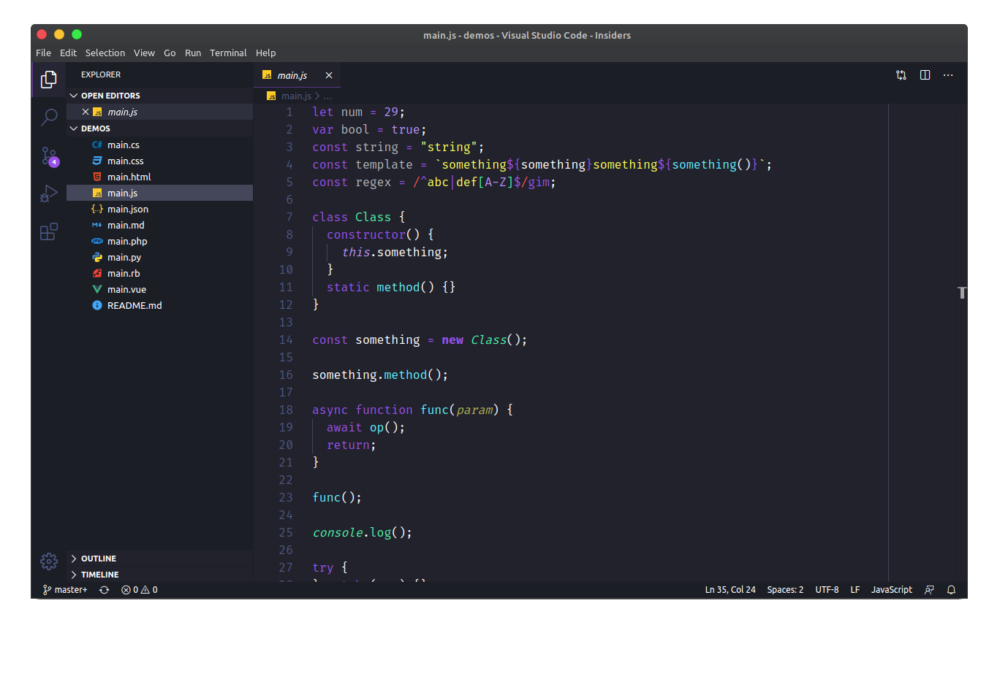

  

<h1 align="center">
  Azeny Theme
</h1>

 A Dark Theme for Dark Programmers.

  

  

<!-- Daqui para cima alterar nos outros arquivos -->

### For more previews in other languages click [here](https://github.com/Azeny/vscode-azeny/blob/master/README-THEME.md#theme-image)

- [Install](#install)
- [Activate theme](#activate-theme)

## Install

1. Open your vscode and press **ctrl + shift + p**
2. Search for **Install Extension** and press enter
3. Write **Azeny**
4. Select it or press Enter to install

## Activate Theme

-  Ctrl + Shift + P
-  Ctrl + Shift + P
-  ⌘ + Shift + P

Type **theme**, choose **Preferences: Color Theme**, choose **Azeny** and press enter

### Some error?

Open one **[issue](https://github.com/Azeny/vscode-azeny/issues)** on github

---

